# BRIDGE

**Clarity that leads to action.**

> **Message → Meaning → Action → Connection**

BRIDGE turns complex or multilingual messages into clear, actionable instructions with dates, locations, missing-information warnings, source evidence, task tracking, and email reminders.

---

## Why we built BRIDGE

BRIDGE grew from a communication problem we see around international students.

Many students receive important university emails, financial notices, orientation instructions, administrative requests, and other messages in English even when English is not their first language.

A student may speak Chinese, Japanese, Spanish, or another language fluently, yet still receive a message containing unfamiliar wording such as:

- complete this before the deadline,
- report to this location,
- verify your information,
- complete these steps,
- update your status afterward.

The message may have been delivered successfully.

But delivery does not automatically mean understanding.

A person may still wonder:

**What does this mean?**

**What exactly am I supposed to do?**

**Which date is the event date, and which one is the deadline?**

**Where do I need to go?**

**What information is missing?**

BRIDGE was built to reduce that gap.

It does more than translate words.

It helps turn a message into **meaning, instructions, evidence, and action**.

---

## The problem goes beyond international students

International communication inspired BRIDGE, but the same problem exists across many sectors.

BRIDGE can support:

- international students
- employees and workplace teams
- parents and families
- older adults
- travelers and newcomers
- schools and universities
- onboarding teams
- customer-support environments
- public-service organizations
- multilingual communication workflows

Anywhere an important instruction can be misunderstood, there is a potential use case for BRIDGE.

> BRIDGE is an assistive communication tool and not a replacement for authoritative medical, legal, financial, or institutional advice.

---

# How BRIDGE works

## 1. Start with the message

The user chooses the language they want BRIDGE to explain the message in, or lets the system detect the source language automatically.

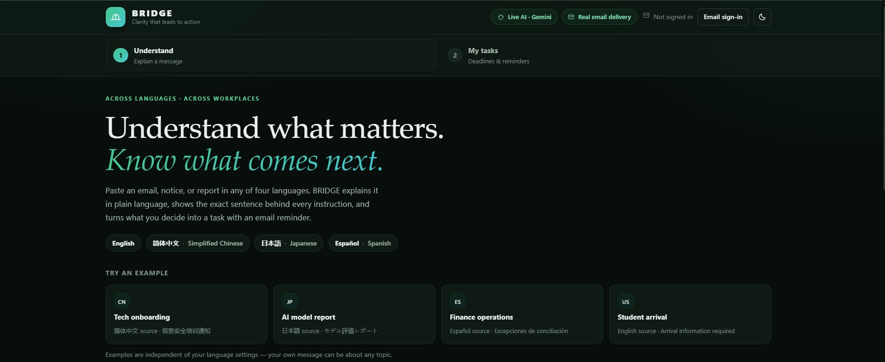

The current prototype supports:

**English · Simplified Chinese · Japanese · Spanish**

---

## 2. Sign in when you want to track tasks

BRIDGE uses passwordless email authentication.

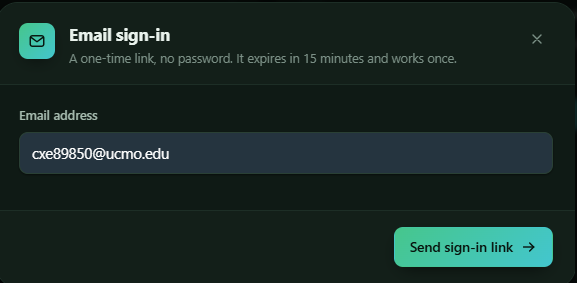

A one-time sign-in link is sent to the user's email.

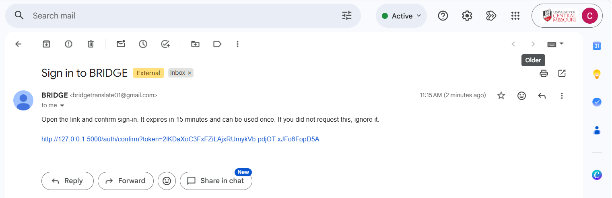

The link expires after 15 minutes and works once.

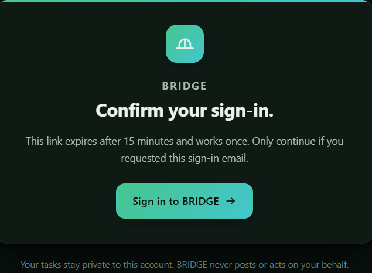

Once authenticated, saved tasks remain associated with the user's account.

---

## 3. Paste a message

The user can paste a message written in any currently supported language.

This example uses Japanese.

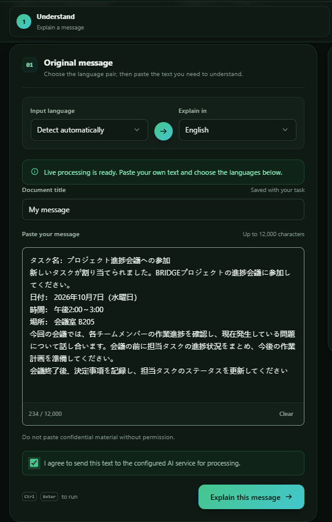

The user does not need to manually ask:

> Translate this.

> Summarize this.

> Find the deadline.

> Extract every instruction.

> Turn this into a checklist.

BRIDGE handles that workflow in one process.

---

## 4. BRIDGE analyzes it

BRIDGE reads the source, identifies instructions, checks important details, and prepares a plain-language result.

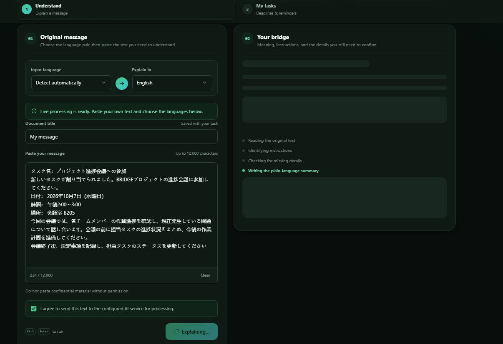

The application looks for:

- overall meaning
- actions
- individual steps
- dates and times
- locations
- conditions
- missing information
- source evidence

---

## 5. The message becomes actionable

BRIDGE returns a structured explanation instead of another long paragraph.

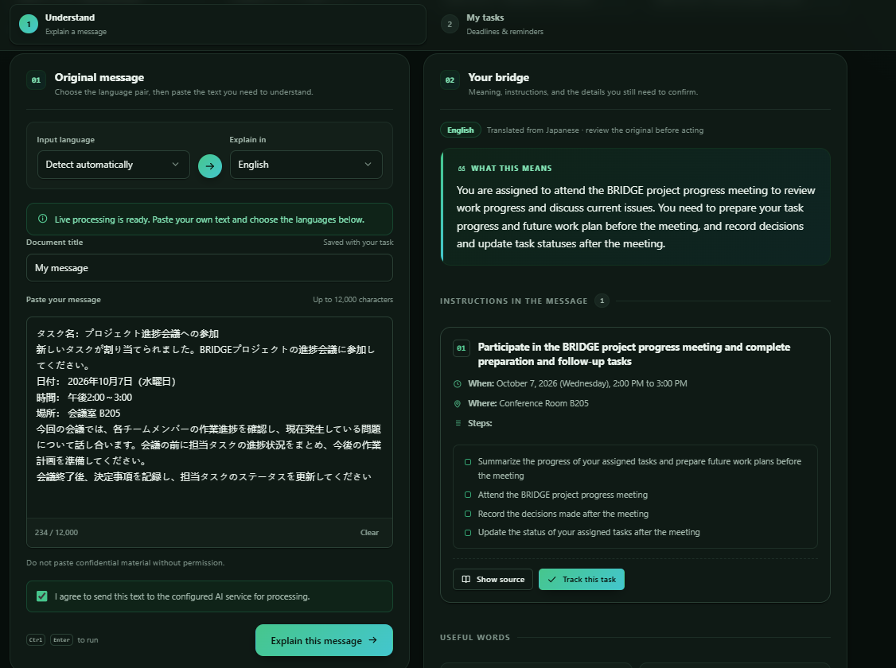

The user can immediately see:

**What this means**

**What they need to do**

**When**

**Where**

**Individual steps**

**Missing or ambiguous information**

BRIDGE also deliberately separates an event schedule from a deadline.

If a message says an activity occurs on October 7 but only says *“submit before the deadline”*, BRIDGE does not automatically claim that October 7 is the submission deadline.

If the deadline is missing, it says so.

---

## 6. Check the original evidence

Generative AI can make mistakes.

BRIDGE therefore preserves the source passage supporting the extracted instruction.

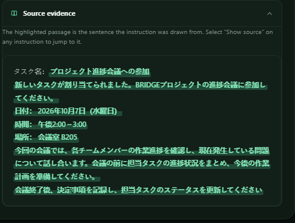

The goal is not:

> Trust the AI because it sounds confident.

The goal is:

> **Here is what BRIDGE understood, and here is the original text that supports it.**

---

## 7. Track what happens next

Understanding the message is only part of the problem.

The user can select **Track this task** and review the task before saving it.

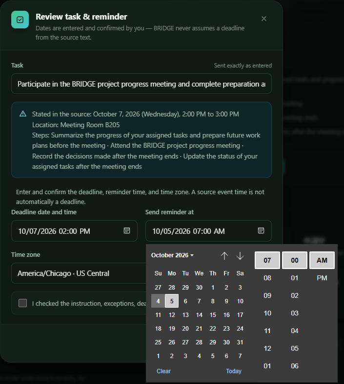

The deadline, reminder time, and time zone are confirmed by the user.

BRIDGE does not silently invent them.

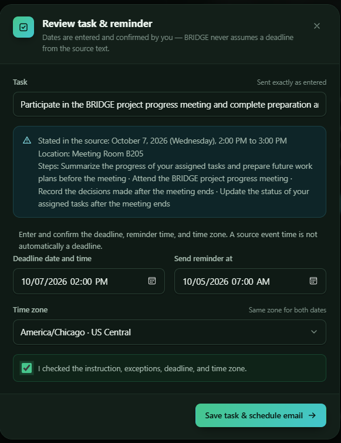

Once saved, the task appears in the user's dashboard.

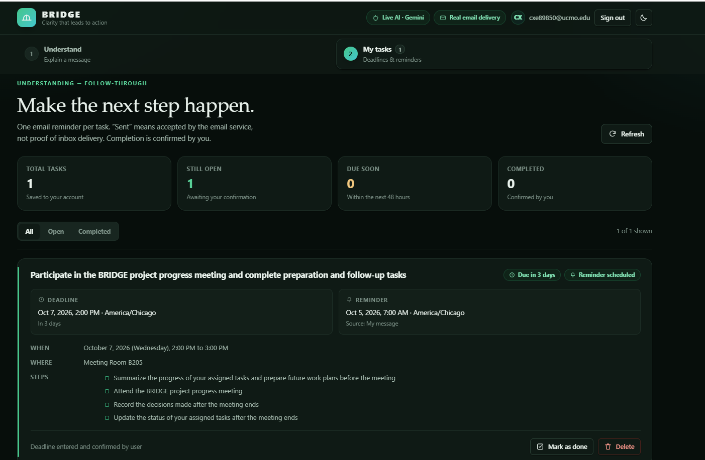

The user can:

- monitor open tasks
- see upcoming deadlines
- review reminder times
- revisit extracted steps
- mark work as complete
- delete tasks that are no longer needed

A background worker checks scheduled reminders and sends the reminder email when it becomes due.

---

# What makes BRIDGE different?

BRIDGE is not simply a translation interface.

And it is not simply a chatbot wrapped around an AI model.

The AI model is one service inside the application.

BRIDGE adds a controlled workflow around it:

- multilingual explanation
- structured task extraction
- source evidence
- missing-information detection
- schedule vs. deadline separation
- JSON Schema validation
- custom translation checks
- passwordless authentication
- persistent task tracking
- reminder scheduling
- email delivery

The goal is not simply **generation**.

The goal is **understanding that can be checked and acted on**.

---

# What we learned while building it

Some of the most important improvements came from things that initially failed.

### Translation can be correct while an instruction is still lost

During multilingual testing, we found cases where an important follow-up instruction such as updating a task status could disappear.

We strengthened extraction so explicit obligations are preserved as actionable steps.

### Dates can be correct but still mean different things

An event time is not automatically a submission deadline.

We changed BRIDGE so uncertainty is exposed rather than silently resolved.

### Multilingual timing can create duplication

We found a Chinese timing case where the translated schedule and source-preservation logic could repeat the same date and time.

We corrected the comparison logic and reran the multilingual checks.

### Fluent AI output is not proof

That led to one of BRIDGE's most important features: **source evidence**.

These changes moved BRIDGE from simply producing an answer toward producing an answer that can be reviewed.

---

# Technology stack

| Layer | Technologies |
|---|---|
| Frontend | HTML, CSS, JavaScript |
| Backend | Python, Flask, Waitress |
| AI | Gemini API with OpenAI-compatible provider support |
| Structured output | JSON, JSON Schema, `jsonschema` |
| Data | SQLite |
| Authentication | Passwordless email sign-in, Flask sessions |
| Email | Gmail SMTP or local development inbox |
| Background processing | Python reminder worker |
| Configuration | `.env`, `python-dotenv` |

### Architecture

**Browser → Flask API → AI analysis → validation → SQLite → reminder worker → email**

For the deeper technical design, see [docs/ARCHITECTURE.md](docs/ARCHITECTURE.md).

---

# Speed, accuracy, and trade-offs

BRIDGE is designed to reduce the number of separate steps involved in interpreting a message:

**read → translate → summarize → extract actions → identify dates → create checklist → remember follow-up**

becomes:

**paste → understand → verify → track**

We do not currently claim a formal percentage of time saved or a measured accuracy score. Those require structured user testing.

Some current trade-offs include:

- AI flexibility vs. deterministic output
- automation vs. user confirmation
- lightweight SQLite storage vs. production-scale infrastructure
- external AI/email services vs. privacy and provider dependence

BRIDGE addresses those risks through structured output, validation, source evidence, user confirmation, and clear limitations.

See:

- [Testing](docs/TESTING.md)
- [Privacy & limitations](docs/PRIVACY_AND_LIMITATIONS.md)

---

# What's next?

The next stage of BRIDGE is about understanding communication wherever it already exists.

Planned directions include:

- PDF and document upload
- OCR for photographed or scanned letters
- voice input
- text-to-speech
- additional languages
- Google Calendar and Outlook Calendar integration
- Gmail and Outlook message import
- Slack, Teams, Notion, and task-platform integrations
- confidence and ambiguity scoring
- conflicting-date detection
- duplicate-task detection
- enterprise privacy controls
- production-scale databases and background jobs

### Our next experiment

A future user study could compare:

1. how long users take to interpret a complex message without BRIDGE,
2. how long they take with BRIDGE,
3. whether they identify the same instructions and dates,
4. where misunderstandings still occur.

That would let us measure real improvements in speed, usability, and interpretation accuracy rather than guessing.

---

# Run BRIDGE locally

Choose your setup guide:

- **Windows:** [WINDOWS_SETUP.md](WINDOWS_SETUP.md)
- **macOS / Linux:** [MAC_LINUX_SETUP.md](MAC_LINUX_SETUP.md)
- **Quick start:** [QUICKSTART.md](QUICKSTART.md)

Configure optional live services:

- **Gemini AI:** [GEMINI_SETUP.md](GEMINI_SETUP.md)
- **Gmail email delivery:** [GMAIL_SETUP.md](GMAIL_SETUP.md)
- **Other live services:** [docs/LIVE_SERVICES.md](docs/LIVE_SERVICES.md)

> Never commit your real `.env`, API keys, Gmail app password, local database, or virtual environment to a public repository. Use `.env.example` as the safe configuration template.

BRIDGE runs with two processes.

### Terminal 1 — web application

```bash
python run.py
```

### Terminal 2 — reminder worker

```bash
python worker.py
```

Then open:

```text
http://127.0.0.1:5000
```

---

# Project structure

```text
BRIDGE/
├── bridge/
├── docs/
├── images/
├── scripts/
├── tests/
├── .env.example
├── .gitignore
├── README.md
├── QUICKSTART.md
├── WINDOWS_SETUP.md
├── MAC_LINUX_SETUP.md
├── GEMINI_SETUP.md
├── GMAIL_SETUP.md
├── requirements.txt
├── requirements-lock.txt
├── requirements-dev.txt
├── run.py
└── worker.py
```

---

# Testing

Install the development requirements and run:

```bash
python -m pip install -r requirements-dev.txt
python -m pytest -q
```

For the multilingual live check:

```bash
python scripts/check_translation.py
```

Read the full testing notes in [docs/TESTING.md](docs/TESTING.md).

---

# Documentation

- [Architecture](docs/ARCHITECTURE.md)
- [Testing](docs/TESTING.md)
- [Privacy & limitations](docs/PRIVACY_AND_LIMITATIONS.md)
- [Deployment](docs/DEPLOYMENT.md)
- [Live services](docs/LIVE_SERVICES.md)
- [Windows setup](WINDOWS_SETUP.md)
- [macOS / Linux setup](MAC_LINUX_SETUP.md)
- [Gemini setup](GEMINI_SETUP.md)
- [Gmail setup](GMAIL_SETUP.md)

---

## Team

Built by:

- Chukwunonyelum Rosalyn Ezeako
- Ruyi Gai
- Odunayo Juliana Owokade

**UCM MuleHacks 2026 — Best Graduate Hack**
